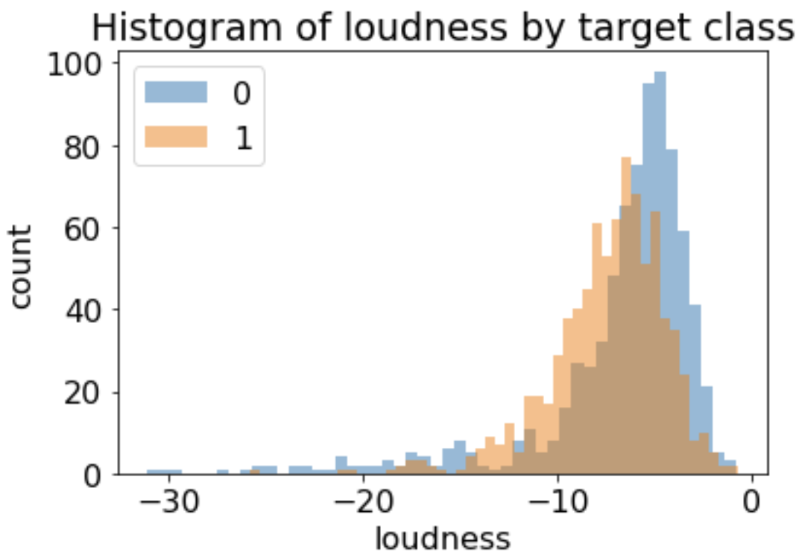

---
jupyter:
  jupytext:
    formats: ipynb,md
    text_representation:
      extension: .md
      format_name: markdown
      format_version: '1.3'
      jupytext_version: 1.14.0
  kernelspec:
    display_name: Python 3 (ipykernel)
    language: python
    name: python3
---

<!-- #region id="YKQdb1gxb_gX" -->
# Homework 3: Decision trees
<!-- #endregion -->

```python id="gVgSpoKBb_gZ"
import matplotlib.pyplot as plt
import numpy as np
import pandas as pd

plt.rcParams["font.size"] = 16

from sklearn.model_selection import cross_val_score, cross_validate, train_test_split
from sklearn.tree import DecisionTreeClassifier
```

<!-- #region id="uSzxaVX8b_gc" -->
## Introducing the data set
 
For this  assignment you'll be looking at Kaggle's [Spotify Song Attributes](https://www.kaggle.com/geomack/spotifyclassification/) dataset.
The dataset contains a number of features of songs from 2017 and a binary variable `target` that represents whether the user liked the song (encoded as 1) or not (encoded as 0). See the documentation of all the features [here](https://developer.spotify.com/documentation/web-api/reference/tracks/get-audio-features/). 

This dataset is publicly available on Kaggle, and you will have to download it yourself. Follow the steps below to get the data CSV. 

1. If you do not have an account with [Kaggle](https://www.kaggle.com/), you will first need to create one (it's free).
2. Login to your account and [download](https://www.kaggle.com/geomack/spotifyclassification/download) the dataset.
3. Unzip the data file if needed, then rename it to `spotify.csv`, and move it to the same directory as this notebook.
<!-- #endregion -->

<!-- #region id="LTE8pzbDb_gc" -->
## Exercise 1: Exploratory data analysis

rubric={points:30}
<!-- #endregion -->

<!-- #region id="gppc2AVUb_gd" -->
#### 1(a) 
rubric={points:2}

Read in the data CSV and store it as a pandas dataframe named `spotify_df`. 

Hints: 
1. There is a missing column name for the first one. Usually, `pandas` give a placehold name, e.g. `Unnamed: 0`.
2. The first column `Unnamed: 0` of the .csv file should be dropped.
<!-- #endregion -->

```python colab={"base_uri": "https://localhost:8080/", "height": 731} deletable=false id="CRfKQk8Ob_gd" nbgrader={"cell_type": "code", "checksum": "8dc4b79dd1df63fe50e357d462d7b09c", "grade": true, "grade_id": "cell-6c7e53c3f36df9b8", "locked": false, "points": 2, "schema_version": 3, "solution": true, "task": false} outputId="eb74d1c8-4622-4ff3-ade0-4a10b1c34f7e"
# BEGIN YOUR CODE HERE
spotify_df = pd.read_csv("spotify.csv",index_col=[0])
# END YOUR CODE HERE

spotify_df
```

<!-- #region id="3ZnUIScfb_gd" -->
#### 1(b)
rubric={points:2}

Run the following line of code to split the data.

Note: we are setting the `random_state` so that everyone has the same split on their assignments. 
This will make it easier for the TAs to grade.
<!-- #endregion -->

```python id="fH6pwobxb_ge"
# Do not modify this cell
df_train, df_test = train_test_split(spotify_df, test_size=0.25, random_state=123)
```

 How many training and test examples do we have?
 Please print the row numbers for `df_train` and `df_test`.

```python colab={"base_uri": "https://localhost:8080/"} deletable=false id="8TE-vOSlhPWI" nbgrader={"cell_type": "code", "checksum": "766ba3a443e43ff8e3ed74636e7770dc", "grade": true, "grade_id": "cell-e7c1dd98396a17e3", "locked": false, "points": 2, "schema_version": 3, "solution": true, "task": false} outputId="1613a42b-160d-4b82-dc44-caaa44ae82cd"
# print the number of training and testing examples
# BEGIN YOUR CODE HERE

print(f"{len(df_train)} is the number of rows in df_train.")
#OR
# print(f"{df_train.shape[0]} is the number of rows in df_train.")

print(f"{df_test.shape[0]} is the number of rows in df_test.")
# END YOUR CODE HERE
```

<!-- #region id="WbKcz75Xb_ge" -->
#### 1(c)
rubric={points:4}

Print out the output of [describe()](https://pandas.pydata.org/docs/reference/api/pandas.DataFrame.describe.html) **on the training split**. This will compute some summary statistics of the numeric columns.

Hints: 
1. Note that `describe` returns another DataFrame for the summary. (Or you can consider the summary is presented in a format of DataFrame.)
<!-- #endregion -->

```python deletable=false id="SghRuwkohh3I" nbgrader={"cell_type": "code", "checksum": "fa82fa4b80993ff7be1a67225a16bb14", "grade": true, "grade_id": "cell-27cc646c77fb0e02", "locked": false, "points": 2, "schema_version": 3, "solution": true, "task": false}
# BEGIN YOUR CODE HERE
df_summary = df_train.describe()
# END YOUR CODE HERE
df_summary
```

Which feature has the smallest range, given this `df_summary`? 

Hints:
1. You can subtract the min value from the max value of the `df_summary` to get the range.
2. Then you use [df.idxmin()](https://pandas.pydata.org/docs/reference/api/pandas.DataFrame.idxmin.html) to find the index/name of the smallest range.

```python deletable=false id="BtwcCvIRiF54" nbgrader={"cell_type": "code", "checksum": "fa6d51cfa53200232de27a0602b91333", "grade": true, "grade_id": "cell-e18dd2a128341061", "locked": false, "points": 2, "schema_version": 3, "solution": true, "task": false}
# BEGIN YOUR CODE HERE
df_summary.loc["diff"] = df_summary.loc["max"] - df_summary.loc["min"]
print(df_summary.idxmin(axis="columns"))
print(f""" \nI am creating a new row to store the difference between max and min.
Then I am using df_summary.idxmin() to find out the name of the column with smallest range.
The smallest range is for the speechiness feature.""")
# END YOUR CODE HERE
```

<!-- #region id="Xjg2Ybcab_gf" -->
#### 1(d) 
rubric={points:12}

Let's focus on the following features:

- danceability
- tempo
- energy
- valence

For each of these features (in order), produce a histogram that shows the distribution of the feature values in the training set, **separated for positive and negative examples**. 
By "positive examples" we mean target = 1 (user liked the song, positive sentiment) and by "negative examples" we mean target = 0 (used disliked the song, negative sentiment). 

As an example, here is what the histogram would look like for a different feature loudness:

<!--  -->
 
<!-- #endregion -->

<!-- #region id="-TiFbgfQb_gf" -->
Hints:
1. You don't have to match all the details exactly, such as colour, but your histograms should look something like this, with a reasonable number of bins to see the shape of the distribution.
2. As shown above, there are two different histograms, one for target = 0 and one for target = 1, and they are overlaid on top of each other. The histogram above shows that extremely quiet songs tend to be disliked (more blue bars than orange on the left) and very loud songs also tend to be disliked (more blue than orange on the far right).
3. Make sure you use a `for` loop for your plotting, rather than repeating the plotting code 4 times. For this to work, I used `plt.show()` at the end of your loop, which draws the figure and resets the canvas for your next plot.
4. You can find the histgram function [here](https://matplotlib.org/stable/api/_as_gen/matplotlib.pyplot.hist.html).
<!-- #endregion -->

<!-- #region id="R8LOhMcVb_gf" -->
Here is some code that separates out the dataset into positive and negative examples, to help you get started:
<!-- #endregion -->

```python id="O138RF8vb_gf"
# Do not modify the code  
negative_examples = df_train.query("target == 0")
positive_examples = df_train.query("target == 1")
```

```python colab={"base_uri": "https://localhost:8080/", "height": 1000} deletable=false id="B5ftK2ncjyXo" nbgrader={"cell_type": "code", "checksum": "f372aae5f3ec0b6db7cdf0a60b97de9c", "grade": true, "grade_id": "cell-491399df3409c8db", "locked": false, "points": 12, "schema_version": 3, "solution": true, "task": false} outputId="599c02a4-898b-4f0b-e3a5-0550b0e7dc0d"
# BEGIN YOUR CODE HERE
cat = ["danceability","tempo","energy","valence"]
# cat = ["loudness"]

for i,j in enumerate(cat):
#     print(j)
        positive_examples[j]
        negative_examples[j]
        plt.figure(i+1)
        plt.hist(negative_examples[j],bins=50,alpha=0.4,label="0")
        plt.hist(positive_examples[j],bins=50,alpha=0.5,label="1")
        
        plt.legend(loc="upper left")
        plt.xlabel(f"{j}")
        plt.ylabel("count")
        plt.title(f"Histogram of {j} by target class")

plt.show()
# END YOUR CODE HERE
```

<!-- #region id="gyg1tEC_b_gg" -->
#### 1(e)
rubric={points:4}

Let's say that, for a particular feature, the histograms of that feature are identical for the two target classes. 
Does that mean the feature is not useful for predicting the target class? (Yes or No, and explain your solution)


<!-- #endregion -->

<!-- #region deletable=false id="jYXeZOvGAjay" nbgrader={"cell_type": "markdown", "checksum": "9c410b2b43d085f6e7dba99cbdddae46", "grade": true, "grade_id": "cell-f5e6059845f2c570", "locked": false, "points": 4, "schema_version": 3, "solution": true, "task": false} -->
<font color='red'>ANSWER</font>

Yes.

In our case of Spotify songs, if the histograms of a feature are identical for the two target classes, it means that for the same value of a feature for a particular song, it received equal number of likes and dislikes. We could also interpret this as for every person who likes the aforementioned song, there will be a person who dislikes the song. By this logic, I think the feature is useful for predicting the target class.
<!-- #endregion -->

<!-- #region id="4923ozQOb_gh" -->
#### 1(f) 
rubric={points:4}

Note that the dataset includes two free text features labeled `song_title` and `artist`:
<!-- #endregion -->

```python colab={"base_uri": "https://localhost:8080/", "height": 206} id="LupikvZeb_gh" outputId="1a8b22a7-87f8-4b6f-b452-23011f47de77"
df_train[["song_title", "artist"]].head()
```

<!-- #region id="sU3-efejb_gh" -->
(1) Do you think these features could be useful in predicting whether the user liked the song or not?  Then explain your answer.
<!-- #endregion -->

<!-- #region deletable=false nbgrader={"cell_type": "markdown", "checksum": "9209b11a881dff70d8060dba341e615f", "grade": true, "grade_id": "cell-802d8b9471c3337f", "locked": false, "points": 2, "schema_version": 3, "solution": true, "task": false} -->
<font color='red'>ANSWER</font>
No. Features like song_title and artist are not useful for in predicting whether the user liked the song or not. It is possible that user only likes a single song by that artist or may be a single album. Therefore, it is possible that user may not like the old work or new work from the same artist.
Same logic applies to the song_title. 
<!-- #endregion -->

(2) Would there be any difficulty in using them in your model?  If yes, what kind of method can solve this difficulty?

<!-- #region deletable=false id="pKgZl2e_5ZWC" nbgrader={"cell_type": "markdown", "checksum": "f9bbd5bf9f7632bb45187548e6bcba80", "grade": true, "grade_id": "cell-902ad95399e2d521", "locked": false, "points": 2, "schema_version": 3, "solution": true, "task": false} -->
<font color='red'>ANSWER</font>
Yes, it would be difficult to use them (abovementioned features) in my model on their own. I would need additional information regarding the artist and the song-title such as genre, additional artitsts that featured on the song etc.
<!-- #endregion -->

<!-- #region id="YOo-zsyTb_gi" -->
## Exercise 2: Using sklearn to build a decision tree classifier

Rubric={points:18}
<!-- #endregion -->

<!-- #region id="yinFqVaub_gi" -->
#### 2(a) 
rubric={points:4}

- Create `X_train` and `y_train` and `X_test` and `y_test` from `df_train` and `df_test` above. Skip the `song_title` and `artist` features for now. 
- Fit a [DecisionTreeClassifier](https://scikit-learn.org/stable/modules/generated/sklearn.tree.DecisionTreeClassifier.html) on the train set.
- Name your classifier as `dt`.

Hints:
1. You first split the features and labels for both `df_train` and `df_test` by using [df.drop()](https://pandas.pydata.org/docs/reference/api/pandas.DataFrame.drop.html).
2. You must name the decision tree classifier as `dt`.
3. You may use the [fit](https://scikit-learn.org/stable/modules/generated/sklearn.tree.DecisionTreeClassifier.html#sklearn.tree.DecisionTreeClassifier.fit) method to train the classifier.
<!-- #endregion -->

```python colab={"base_uri": "https://localhost:8080/"} deletable=false id="dj4fqSHtb_gi" nbgrader={"cell_type": "code", "checksum": "a55f63ab2dd6192a99f8375c0e270ec2", "grade": true, "grade_id": "cell-1c8bf38818488103", "locked": false, "points": 4, "schema_version": 3, "solution": true, "task": false} outputId="9f893f45-7e30-476f-a773-a2782748ec73"
dt = None

# BEGIN YOUR CODE HERE
df_train= df_train.drop(columns=["song_title","artist"])
df_test = df_test.drop(columns=["song_title","artist"])

X_train = df_train.drop(columns = ["target"])
y_train = df_train["target"]

X_test = df_test.drop(columns = ["target"])
y_test = df_test["target"]

dt = DecisionTreeClassifier()
dt.fit(X_train,y_train)
# END YOUR CODE HERE
```

<!-- #region id="SX4oJduHb_gi" -->
#### 2(b)
rubric={points:2}

Use the `predict` method to predict the class of the first example in your `X_train`. Is the prediction correct? That is, does it match with the corresponding true label in `y_train`?  Please print your prediction and the true label for the first example.

Hints: 
1. You can grab the first example with `X_train.iloc[[0]]`.
<!-- #endregion -->

```python colab={"base_uri": "https://localhost:8080/"} deletable=false id="pfY457gU0VX6" nbgrader={"cell_type": "code", "checksum": "617ab084e783b232e91147c48c8f30bc", "grade": true, "grade_id": "cell-cfcd6f4af7f85141", "locked": false, "points": 2, "schema_version": 3, "solution": true, "task": false} outputId="e5220234-04b5-42d0-d731-ae1f52bfc12c"
# BEGIN YOUR CODE HERE

predict = dt.predict(X_train)
print(f" The prediction made is target = {predict[0]}.")
y_train.iloc[[0]]
print(f" The true label in y_train corresponding with X-train is {y_train.iloc[0]}.")

# END YOUR CODE HERE
```

<!-- #region id="6Syt6jR3b_gi" -->
#### 2(c) 
rubric={points:2}

Use the [cross_val_score](https://scikit-learn.org/stable/modules/generated/sklearn.model_selection.cross_val_score.html) function on your training set to compute the 10-fold cross-validation accuracy of your tree. 

Save the cross validation accuracy to `cv_scores`.
<!-- #endregion -->

```python colab={"base_uri": "https://localhost:8080/"} deletable=false id="jYyo7U1Mb_gj" nbgrader={"cell_type": "code", "checksum": "56de02caf1948ac7dc8f69e5fea7c0c1", "grade": true, "grade_id": "cell-6cb370aade42b5b9", "locked": false, "points": 2, "schema_version": 3, "solution": true, "task": false} outputId="f39fd524-df50-4d4b-c16a-599df5ac8cf3"
cv_scores = None

# BEGIN YOUR CODE HERE
cv_scores = cross_val_score(dt,X_train,y_train,cv=10)
# END YOUR CODE HERE
cv_scores
```

<!-- #region id="b0KxZJfab_gj" -->
#### 2(d)
rubric={points:6}

The above is useful, but we would like to see more results, e.g., `fit_time`, `score_time`, `test_score`, `train_score`. 

- Compute the 10-fold cross-validation again but this time using the [cross_validate](https://scikit-learn.org/stable/modules/generated/sklearn.model_selection.cross_validate.html) function with `return_train_score=True` and `cv=10`. 
- Save the results in `scores`.
<!-- #endregion -->

```python colab={"base_uri": "https://localhost:8080/"} deletable=false id="ZCugmvpR2A4C" nbgrader={"cell_type": "code", "checksum": "b6b885f3f33f96fcc8a90611c58b7542", "grade": true, "grade_id": "cell-cb08fe725fc6fbee", "locked": false, "points": 6, "schema_version": 3, "solution": true, "task": false} outputId="f605bbd5-a8a6-4e62-d9dc-4569bba75e3b"
scores = None

# BEGIN YOUR CODE HERE
scores = cross_validate(dt,X_train,y_train,cv=10,return_train_score=True)
# END YOUR CODE HERE

scores
```

<!-- #region id="XnSYRHO-b_gj" -->
#### 2(e)
rubric={points:3}

Do you see a significant difference between the training score and the cross-validation score? Briefly discuss.
<!-- #endregion -->

<!-- #region deletable=false id="l5cDjNN0b_gj" nbgrader={"cell_type": "markdown", "checksum": "ca7c69511bff903487cb1b242d99d683", "grade": true, "grade_id": "cell-154a5a3791e6221c", "locked": false, "points": 3, "schema_version": 3, "solution": true, "task": false} -->
<font color='red'>YOUR ANSWER HERE</font> Yes. I am observing huge difference in train score vs cross validation score (test-score). The model is 100  percent accurate when dealing with the training data, but only about 65-70 percent accurate with test data. One way to interpret this would be, that the model is overfitting to train data. 

<!-- #endregion -->

<!-- #region id="7y5HxEsDb_gj" -->
#### 2(f)
rubric={points:3}

Inspect the 10 sub-scores from the 10 folds of cross-validation. How does this inform the trustworthiness of your cross validation score?
<!-- #endregion -->

<!-- #region deletable=false id="_9ARc9Y7b_gk" nbgrader={"cell_type": "markdown", "checksum": "86c92f157e8d102db7a536a0b0142b44", "grade": true, "grade_id": "cell-d41a9b004de3c338", "locked": false, "points": 3, "schema_version": 3, "solution": true, "task": false} -->
<font color='red'>ANSWER</font> The cross validation score from cross_val_score functions are about 65% with +/-5% variation. These scores are somewhat consistent across all the 10 folds. This means that model is able to generalise well and avoid overfitting.
<!-- #endregion -->

<!-- #region id="FDn1B520b_gk" -->
## Exercise 3: Hyperparameters 
rubric={points:32}

In this exercise, you'll experiment with the `max_depth` hyperparameter of the decision tree classifier. See the [`DecisionTreeClassifier` documentation](https://scikit-learn.org/stable/modules/generated/sklearn.tree.DecisionTreeClassifier.html) for more details.

- Explore the `max_depth` hyperparameter. Run 10-fold cross-validation for trees with different values of `max_depth` (at least 10 different values in the range 1 to 25). {points:10}
- For each `max_depth`, get both the **train accuracy** and the **cross-validation accuracy**. {points:6}
- Make a plot with `max_depth` on the *x*-axis and the train and cross-validation scores on the *y*-axis. That is, your plot should have two curves, one for train and one for cross-validation. Include a legend to specify which is which. {points:6}
- Discuss how changing the `max_depth` hyperparameter affects the training and cross-validation accuracy. From these results, what depth would you pick as the optimal depth? {points:5}
- Do you think that the depth you chose would generalize to other "spotify" datasets (i.e., data on other spotify users)?{points:5}
<!-- #endregion -->

```python colab={"base_uri": "https://localhost:8080/", "height": 1000} deletable=false id="0T-sNbEWQ6Mh" nbgrader={"cell_type": "code", "checksum": "d82d3b26bec8314820a5752d7d6f0937", "grade": true, "grade_id": "cell-3ca54674a3980cb6", "locked": false, "points": 32, "schema_version": 3, "solution": true, "task": false} outputId="842671d6-8ae3-4d57-aef1-5b7fe85f60f1"
# BEGIN YOUR CODE HERE
from statistics import mean
rand_n = [1,3,5,7,9,13,15,17,21,23]
test_score = [0]*10
train_score = [0]*10
for i,j in enumerate(rand_n):
    dt_m = DecisionTreeClassifier(max_depth=j)
    dt_m.fit(X_train,y_train)
    scores_m = cross_validate(dt_m,X_train,y_train,cv=10,return_train_score=True)
    print(f"Test Score for max_depth({j}) \n :{scores_m['test_score']} \n")
    print(f"Train Score for max_depth({j})\n :{scores_m['train_score']} \n")
    print("----------------------------------------------------------------")
    test_score[i] = mean(scores_m['test_score'])
    train_score[i] = mean(scores_m['train_score'])
    
plt.plot(rand_n,train_score,'x-',label='train_score')
plt.plot(rand_n,test_score,'rx-',label='cross_validation_score')
plt.xlabel("Max Depth")
plt.ylabel("Accuracy Scores in Percentage")
plt.title("Plot of Max Depth against train score and cross validation score")
plt.legend()
# END YOUR CODE HERE

```

<!-- #region deletable=false id="-aq1HciMb_gk" nbgrader={"cell_type": "markdown", "checksum": "8f5b1cab236fca8b23063a62141ff253", "grade": true, "grade_id": "cell-9bbb86d59cdb7a4a", "locked": false, "points": 0, "schema_version": 3, "solution": true, "task": false} -->
<font color='red'>ANSWER</font>
1) As we keep on increasing the max_depth, it seems that the model learns the training dataset. This is why we see near-perfect training scores and low test scores. The max_depth hyperparameter allos the tree to go deeper which makes the model more complex and thus training error goes down. However, complex model has adverse effect on the test accuracy. Too high max_depth can lower the test_score accuracy and the model would overfit.

A optimal max_depth would be the one, where the trade-off between two scores is acceptable. In other words,optimal max depth is one where difference between train score and test score is not too much. The optimal gap indicates that out model is able to generalise the data well and does not overfit.
From the observing the plot and the data, I would choose 9 as the optimal max_depth.
***
2) No. I do not think that the a single max_depth would be able to generalise to other spotify datasets. Assume we have a user who only listens to classical music or hip-hop music and another user with eclectic music choice. The max_depth for each of the user dataset will be different, since the dataset differ from each other drastically.
<!-- #endregion -->

<!-- #region id="2g2OHIaeb_gk" -->
## Exercise 4: Test set
rubric={points:10}

Remember the test set you created way back at the beginning of this assignment? Let's use it now to see if our cross-validation score from the previous exercise is trustworthy. 

- Select your favorite `max_depth` from the previous part.
- Train a decision tree classifier using that `max_depth` on the _entire training set_.
- Compute and display the test score. 
<!-- #endregion -->

```python colab={"base_uri": "https://localhost:8080/"} deletable=false id="BceWsGGz2B6M" nbgrader={"cell_type": "code", "checksum": "4cba16beedbaf5bee4dcbd9b8e2f21e8", "grade": true, "grade_id": "cell-2589d747c10fddd6", "locked": false, "points": 5, "schema_version": 3, "solution": true, "task": false} outputId="734563d9-05c1-4b38-ae27-63c13dacb3f7"
# BEGIN YOUR CODE HERE
dt_4 = DecisionTreeClassifier(max_depth=9)
dt_4.fit(X_test,y_test)
scores_4 = cross_validate(dt_4,X_test,y_test,cv=10,return_train_score=True)
print(f"The test scores for Test data are \n: {scores_4['test_score']}")
# END YOUR CODE HERE
```

How does it compare to the cross-validation score from the previous exercise? Briefly discuss. 

<!-- #region deletable=false id="S-G_2bK_8hxR" nbgrader={"cell_type": "markdown", "checksum": "d8e0b0babb3c2c0d0d7133cc2051f414", "grade": true, "grade_id": "cell-0e4d1a2613fcbd1d", "locked": false, "points": 5, "schema_version": 3, "solution": true, "task": false} -->
<font color='red'>ANSWER</font>

Comparing the test score or cross validation score from max_depth = 9 for Q3 and Q4, shows us that the cross validation score in previous example was higher than that of in this example with test data set.
In more stricter sense, the test score for same max_depth for test data split show accuracy of 60% +/-5%, whereas in the previous example for train data split, we see accuracy of 69% +/- 3%. In other words, we had better accuracy with less variance for train data than for test data.

One reason for this would that our test data split was smaller than the train data split. Therefore, our model with train data split shows better score than the model with test data split.

<!-- #endregion -->

<!-- #region deletable=false editable=false id="U6DWrQU5b_gl" nbgrader={"cell_type": "markdown", "checksum": "f760aab0644cf6f58dd59a68fd255705", "grade": false, "grade_id": "cell-e49d29625e38812d", "locked": true, "points": 10, "schema_version": 3, "solution": false, "task": true} -->
## Submission instructions 
rubric={points:10}

**PLEASE READ:** When you are ready to submit your assignment do the following:

1. Run all cells in your notebook to make sure there are no errors by doing `Kernel -> Restart Kernel and Clear All Outputs` and then `Run -> Run All Cells`. 
2. Notebooks with cell execution numbers out of order or not starting from “1” will have marks deducted. Notebooks without the output displayed may not be graded at all (because we need to see the output in order to grade your work).
3. Upload the assignment at Canvas. 
4. Finish the corresponding reflection survey.
<!-- #endregion -->
